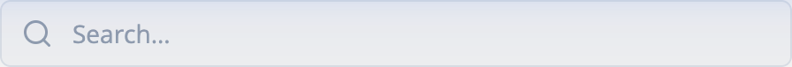
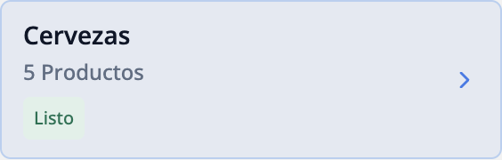
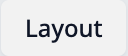
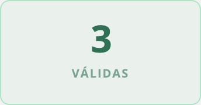
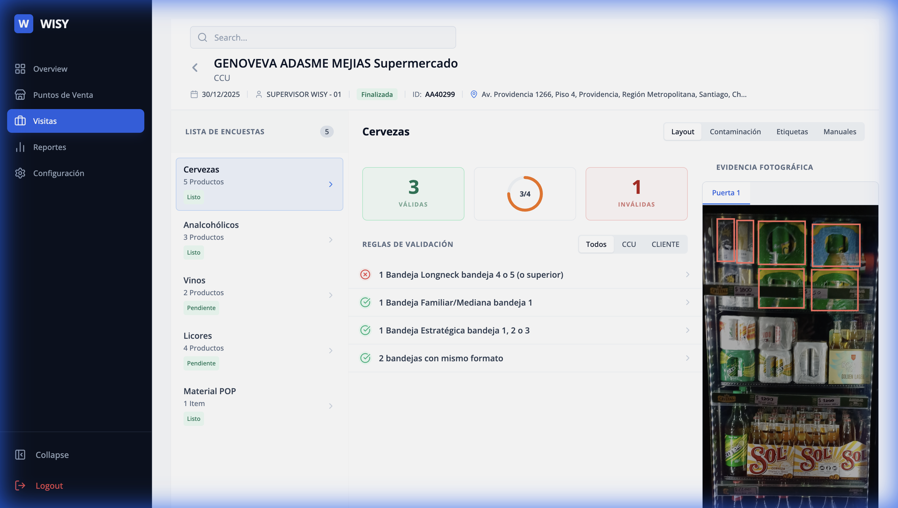

# Wisy Visit Dashboard

## 🎯 Objective
To deliver a **modern, enterprise-grade SaaS dashboard** for managing retail execution visits. The primary goal was to transform a complex data visualization challenge (store audits, product layouts, compliance rules) into a clean, intuitive, and highly responsive user interface.

The design focuses on **Readability**, **Efficiency**, and **Visual Hierarchy**, ensuring that supervisors can quickly assess store compliance, validate photos, and manage inventory tasks without cognitive overload.

---

## 📸 Visual Guide & Component Library

Below is a detailed breakdown of every key UI component, including visual references and the exact code used to build them.

### 1. Main Header & Title
The top navigation bar containing the Visit Title, Back Button, and Search.


**Design**: Fixed height `h-[72px]`, sticky top, transparent/white background.
**Code**:
```tsx
<div className="px-6 h-[72px] flex items-center justify-between gap-3 shrink-0 bg-white border-b border-slate-100">
  <div className="flex items-center gap-3">
    <button onClick={onBack} className="p-1.5 -ml-1.5 hover:bg-slate-50 rounded-full text-slate-400 transition-colors">
      <ArrowLeft size={20} />
    </button>
    <h2 className="text-lg font-bold text-slate-900 truncate">GENOVEVA ADASME MEJIAS</h2>
  </div>
</div>
```

### 2. Search Input
Clean, focused search bar for finding products.



**Design**: `bg-slate-50` focusing to `bg-white` with blue ring.
**Code**:
```tsx
<div className="relative">
  <Search className="absolute left-3 top-1/2 -translate-y-1/2 text-slate-400" size={16} />
  <input
    type="text"
    placeholder="Buscar..."
    className="pl-10 pr-4 py-2 bg-slate-50 border border-slate-200 rounded-md text-sm focus:ring-2 focus:ring-blue-500/20 focus:border-blue-400 focus:bg-white transition-all w-64"
  />
</div>
```

### 3. Survey List (Sidebar)
The master navigation list.



**Design**: "Edge Highlight" style for active items.
**Code**:
```tsx
// Active State
<button className="w-full flex items-center justify-between px-3 py-2.5 bg-blue-50 text-blue-700 border border-blue-200 rounded-md">
  <span className="font-semibold">Cervezas</span>
  <ChevronRight size={16} className="text-blue-500" />
</button>

// Inactive Hover
<button className="w-full ... text-slate-600 hover:bg-slate-50 hover:text-slate-900 border-transparent">
  <span className="font-semibold">Analcohólicos</span>
</button>
```

### 4. Toggles / Filters
Segmented controls to switch views (e.g., Layout vs Contamination).



**Design**: `bg-slate-100` container with `bg-white` shadow-sm buttons.
**Code**:
```tsx
<div className="inline-flex bg-slate-100 rounded-md p-0.5 gap-0.5">
  <button className="px-3 py-1.5 text-xs font-medium bg-white text-slate-900 shadow-sm rounded">Layout</button>
  <button className="px-3 py-1.5 text-xs font-medium text-slate-600 hover:text-slate-900">Contaminación</button>
</div>
```

### 5. Metric Status Cards (Middle Section)
The core dashboard metrics.



**Design**: `rounded-xl` cards with specific color themes.
**Code**:
```tsx
// Green Card (Valid)
<div className="bg-emerald-50/50 border border-emerald-200 rounded-lg px-2 py-4 flex flex-col items-center">
  <span className="text-[32px] font-bold text-emerald-700">4</span>
  <span className="text-[10px] font-bold text-emerald-700 opacity-60 uppercase">VÁLIDAS</span>
</div>

// Score Card with Chart
<div className="bg-white border border-slate-200/60 rounded-lg ...">
  <CircularProgress current={3} total={4} color="green" /> {/* Green/Red Only */}
</div>
```

### 6. Photo Gallery (Right Panel)
The evidence viewer with door selection tabs.



**Design**: Dark header/tabs for contrast, light image area.
**Code**:
```tsx
<div className="flex flex-col h-full bg-slate-900">
  {/* Door Tabs */}
  <div className="flex gap-1 p-2 bg-slate-800">
    <button className="flex-1 py-2 bg-blue-600 text-white font-bold rounded text-xs">P 1</button>
    <button className="flex-1 py-2 bg-slate-700 text-slate-400 font-medium rounded text-xs">P 2</button>
  </div>
  {/* Image Area */}
  <div className="flex-1 relative bg-black flex items-center justify-center overflow-hidden">
    
    {/* Bounding Boxes via SVG overlay */}
  </div>
</div>
```

---

## 🚀 How to Run
1.  **Install Dependencies**: `npm install`
2.  **Start Dev Server**: `npm run dev`
3.  **View**: Open `http://localhost:3000` (or displayed port).
